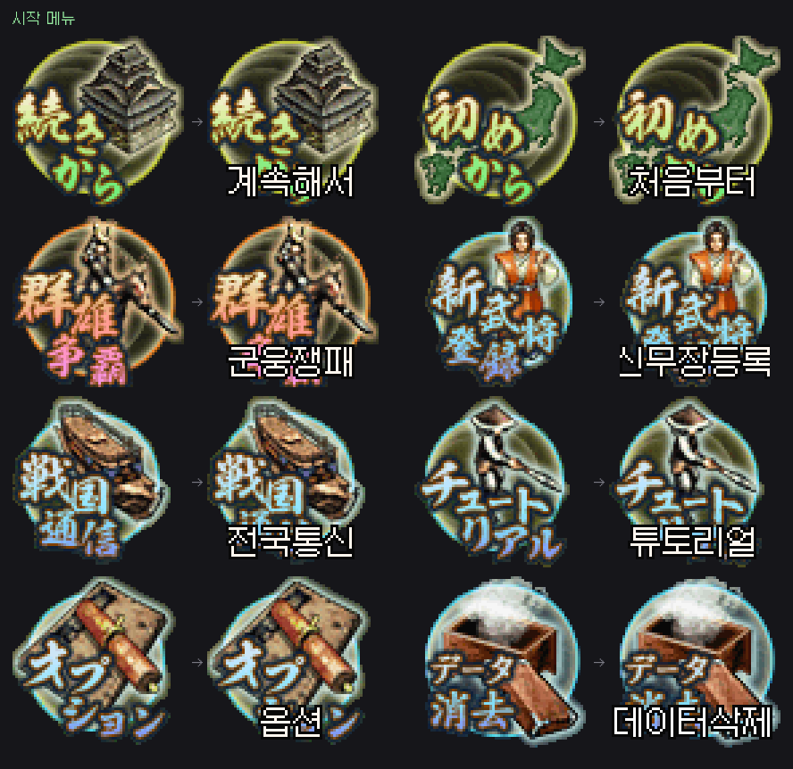
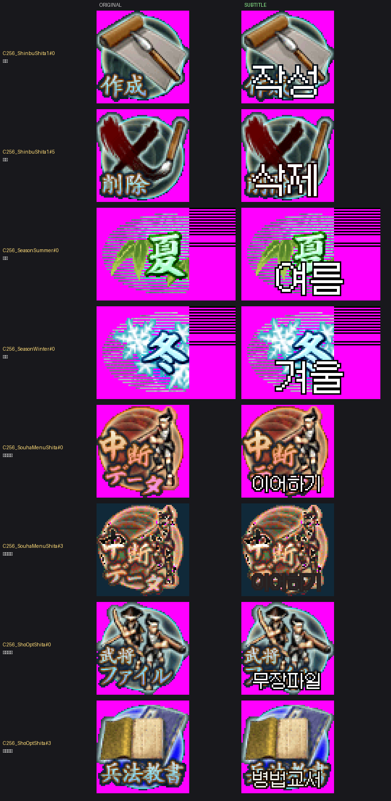
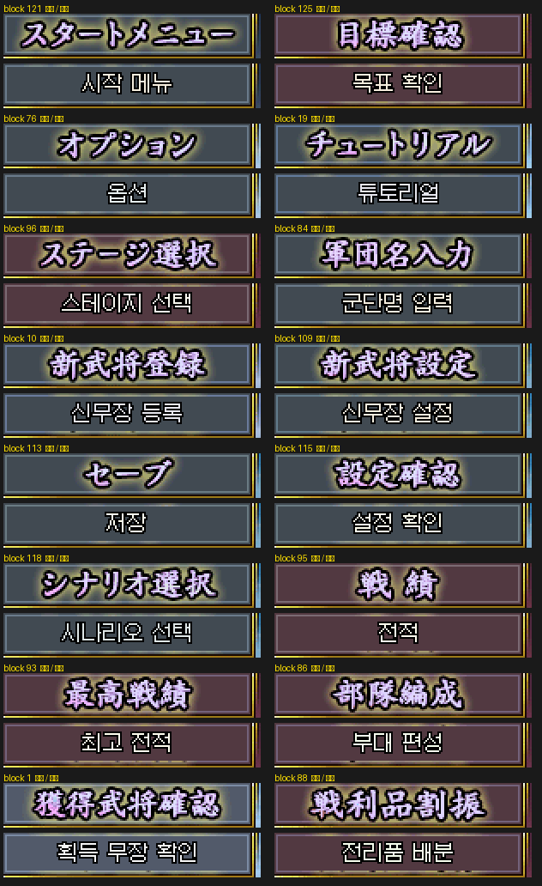
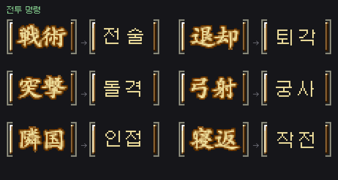
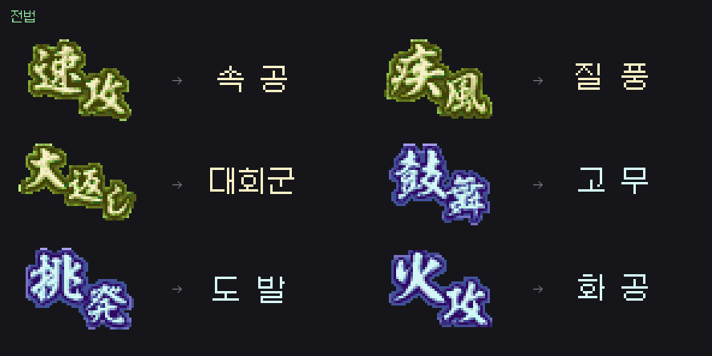
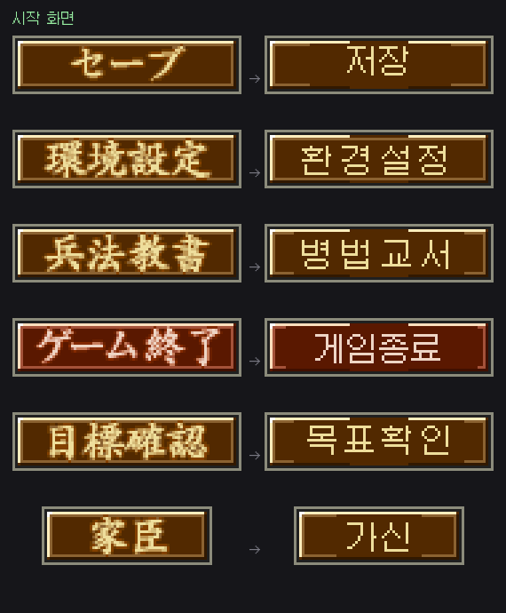

# 노부나가의 야망 DS 2 한글패치

코에이 **노부나가의 야망 DS 2** (信長の野望DS 2, 2008, CN2J)의 비공식 한글화 패치입니다.

패치 파일만 받아 쓰셔도 되고, **이 저장소만으로 처음부터 직접 빌드**하실 수도 있습니다.
번역문·폰트·라벨·도구가 전부 들어 있으며, 빌드 결과는 배포본과 바이트 단위로 같습니다.

- **패치만 적용** → 아래 [적용 방법](#적용-방법)
- **직접 빌드하거나 번역을 고치고 싶다** → **[BUILD.md](BUILD.md)**

---

## 적용 방법

1. 본인이 소유한 **일본판 ROM**을 준비합니다. (원본 CRC32 `72C536BA`)
2. [릴리즈](https://github.com/snake759494/nobunaga-ds2-korean-patch/releases)에서 `nobu2-kr.xdelta` 를 받습니다.
3. xdelta 도구로 적용합니다.
   ```
   xdelta3 -d -s "Nobunaga no Yabou DS 2 (Japan).nds" nobu2-kr.xdelta "한글판.nds"
   ```
   - Windows: xdeltaUI 또는 [xdelta3](https://github.com/jmacd/xdelta)
   - 웹: [RomPatcher.js](https://www.marcrobledo.com/RomPatcher.js/)
4. melonDS / DeSmuME 등 에뮬레이터나 실기에서 구동합니다.

패치 후 CRC32는 `24C70E29` 입니다.

---

## 무엇이 한글이 되었나

- 게임 내장 12×12 비트맵 폰트를 **갈무리11**로 교체
- 대사·이벤트·메뉴 설명·튜토리얼·무장 열전 등 **msgsec 텍스트 전체** (약 10,000 유닛 / 원문 267KB)
- 무장·지명·성·가보·전법 이름 데이터베이스(`common.snr`) 음역 및 번역
  — 율령국 52개는 **음독**(三河 → 삼하)으로 표기해 2글자 필드에 정확히 맞춤
- ARM9 내장 시스템 메시지
- **스프라이트에 구워진 메뉴 글자** — 전략 메뉴, 전투 명령, 전법 이름,
  쟁패 시나리오 제목, 저장/환경설정 화면 등
- **배경에 구워진 화면 제목** — `시작 메뉴`·`옵션`·`저장`·`전적`·`부대 편성` 등
  배너 16개. 스프라이트가 아니라 배경 그림이라 따로 다시 그립니다
- **그림 위 캡션** — 아이콘·계절 화면처럼 글자와 그림이 붙어 있는 곳은
  그림을 그대로 두고 **흰 글자 + 검은 테두리** 한국어 자막을 원문 위에 표시

| 시작 메뉴 | 그림 위 자막 |
|---|---|
|  |  |

배경에 구워진 화면 제목(위가 원본, 아래가 결과)



### 대표 컷

| 전략 메뉴 | 정보 항목 |
|---|---|
|  |  |

| 전투 명령 | 전법 |
|---|---|
|  |  |

| 시작 화면 | 쟁패 시나리오 |
|---|---|
|  |  |

`images/sheets/` 에 변경된 셀 **전수 비교 시트**가 있습니다. 각 행 왼쪽이 원본,
오른쪽이 결과입니다.

---

## 버전 기록

| 버전 | 내용 |
|---|---|
| v1.0~v1.2 | 폰트 교체, 전체 번역, 첫 릴리즈 |
| v1.3 | 게임 메시지 버퍼 상한(16,137B) 내에서 문장 확장 — 진행 중 멈춤 수정 |
| v1.4 | 스프라이트 메뉴 라벨 한글화 시작 |
| v1.5 | **무장 데이터베이스 이진 필드 손상 수정** (얼굴 번호가 뒤바뀌던 중대 버그) |
| v1.6~v1.8 | 축약 정책 반전 + 전보체 문장 1,332개를 자연스러운 문장으로 교체 |
| v1.9 | 게임 내 이미지 2,276장 전수 추출·판독 후 라벨 한글화 |
| v1.9.1 | 그래픽 결함 수정 (버튼판 소실·글자 겹침·일러스트 파괴), 자동 손상 검출기 도입 |
| v1.10 | **한자가 한글로 깨져 보이던 문제 해결**, 영지명 음독 전환으로 국명 충돌 제거, 네이버 카페 자료 기반 용어 교정 |
| v1.11 | 그림 위 **자막 오버레이** 도입(계절·아이콘 메뉴), 메뉴 내 글자 크기 통일 |
| v1.12 | 문장 조각 어미 중복·국명 조사 누락 수정, 처우 화면·전략 메뉴 그래픽 라벨 보완, 공유 아틀라스 패치 안정화 |
| v1.13 | 시작 메뉴 7개 그림 캡션·버튼 용어 보완, 첨부 비교 시트 반영, 시작화면 정적 안내문 중복 제거, 일반 UI 하십시오체 정리 |
| v1.14 | 릴리즈 이미지 전수 재검수, 누락된 일반 메뉴 라벨·계절/아이콘 캡션 보완, 원화에 남던 일본어 제거, 비교 PNG 갤러리 갱신 |
| v1.15 | **시작 메뉴 아이콘 라벨 어긋남·가독성 수정** (이슈 #1): 256색 시트의 타일 경계·팔레트 계산 오류로 두 번째 아이콘부터 엉뚱한 그림에 글자가 찍히던 문제 해결, 검은 판 대신 원문 위 흰 글자+검은 테두리 자막으로 통일, 시작·옵션·쟁패·신무장 메뉴와 난이도/설정 버튼 자막 재배치 |
| v1.16 | **배경에 구워진 화면 제목 16개 한글화**(시작 메뉴·옵션·튜토리얼·저장·설정 확인·시나리오 선택·스테이지 선택·신무장 등록/설정·전적·최고 전적·부대 편성·목표 확인·군단명 입력·획득 무장 확인·전리품 배분), SP무장설정·환경설정·로드 배너와 쟁패 결과(목표달성/목표실패·기록갱신)·맹장/용장/지장 자막 추가 |

---

## 알려진 제한 사항

- **타이틀 화면과 스태프롤**은 일본어입니다. 스태프롤은 역할·이름 2행 블록이라
  단일행 레이아웃으로 재현할 수 없습니다.
- 시작 화면의 정적 `GrpBG` 안내문은 일본어 문구를 제거하고 일반 메시지 레이어만
  표시하도록 수정했습니다. `버튼을 누르거나 / 아래 화면을 터치하세요`가 중복으로
  보이지 않아야 합니다(이전 저장소 이슈 #4).
- 배경에 구워진 **본문·설명문**(튜토리얼 해설, 전투 정보창 항목명 등)은 아직
  일본어입니다. 이번 릴리즈에서 한글이 된 것은 화면 제목 배너 16개입니다.
- **일러스트에 캡션이 얹힌 그래픽**(시작 메뉴·옵션·쟁패·신무장 아이콘, 계절 원판)은
  그림을 훼손하지 않도록 원문 위에 한국어 자막을 얹습니다. 자막이 원문보다 좁은
  두 글자 라벨(작성·삭제 등)은 원문 한자가 자막 옆으로 조금 비칩니다. 라벨
  매니페스트에 없는 그림과 스태프롤은 원문을 유지합니다.
- 아래 셀도 안전을 위해 원문을 유지합니다.
  - 서로 다른 문구가 같은 타일을 공유하는 경우 (예: 세이브 화면의
    `データがありません` / `プレイ時間`)
  - 한글이 원문보다 1.5배 넘게 넓거나, 글자당 폭이 7px 미만인 경우
- **그래픽 안전 제한**: 그림과 글자가 같은 타일을 공유하는 일부 셀은 원문을
  유지하거나 자막을 사용합니다. 빌드 시 공유 아틀라스 충돌·셀 밖 변경을 자동 검사합니다.
- `陸奥`(육오) 한 곳은 이름 필드가 안전 목록 밖이라 한자 그대로 표시됩니다.
  이진 레코드 손상을 막기 위한 의도적 제외입니다.
- 신무장 작성 시 한자 입력기는 한글 음절 선택기로 동작합니다 (폰트 교체의 부수 효과).
- 바이트 예산이 극히 작은 1바이트 조사는 공백 처리되어 문장이 살짝 축약될 수 있습니다.
- Wi-Fi(WFC) 화면은 서비스 종료로 검증하지 못했습니다.

---

## 기술 요약

자세한 설명은 [BUILD.md](BUILD.md) 에 있습니다.

- **폰트**: ARM9 내장 12×12 1bpp 연속 패킹 폰트(글리프 3,574개, `0x178E64`),
  SJIS→글리프 룩업 테이블(`0x173514`) 리버싱
- **한글 인코딩**: 한자 글리프 슬롯 약 3,200칸에 사용 음절을 동적 배정해
  글리프 비트맵만 교체 — 게임 엔진은 건드리지 않음
- **대사 확장**: msgsec 컨테이너를 재조립하고 내부 포인터를 재계산.
  버퍼 상한을 넘으면 *상대 품질 손실이 가장 적은* 문장부터 한 단계씩 축약
- **그래픽**: NCLR/NCGR/NCER 파싱. UI 문자는 글리프 아틀라스라
  `確定`과 `確認`이 `確` 타일을 공유하므로 **글자 단위**로 그려 공유 글리프가
  항상 같은 음절을 받게 함 (한자음 1:1)
- **글리프 충돌 회피**: 한글은 한자 글리프 슬롯을 빌려 쓰므로, 아직 화면에
  출력되는 한자의 슬롯을 쓰면 그 한자가 엉뚱한 한글로 보인다(織田家 → "오다덕").
  게임이 출력할 수 있는 모든 한자를 예약하고 **한 번도 출력되지 않는 슬롯에만**
  한글을 배정한다 (`tools/check_glyph_clash.py` 로 검증)
- **손상 검출**: 패처가 셀마다 수정 허용 사각형을 기록하고, 그 밖에서 바뀐
  픽셀을 전수 집계 (`tools/gfx/check_damage.py`)
- **용어 근거**: 네이버 카페 정리글을 표로 만들어 기계적으로 적용
  ([docs/REFERENCE.md](docs/REFERENCE.md))

---

## 기여

번역이 어색하거나 글자가 깨진 곳을 발견하시면 이슈나 PR을 남겨 주세요.
고치는 방법은 [BUILD.md 8장](BUILD.md#8-번역을-고치고-싶다면) 에 있습니다.

---

## 라이선스 / 고지

- 이 저장소는 **패치 파일·번역문·도구만** 포함하며 게임 데이터(ROM)는 포함하지 않습니다.
- 게임 저작권은 KOEI(現 코에이테크모)에 있습니다. 패치는 본인 소유 사본에만 적용하십시오.
- 한글 폰트: [Galmuri](https://github.com/quiple/galmuri) (SIL OFL 1.1)
- 도구와 번역문은 자유롭게 쓰고 고치고 재배포하셔도 됩니다. 출처만 밝혀 주세요.
- 번역·패치 도구: Claude (Anthropic) 협업으로 제작
